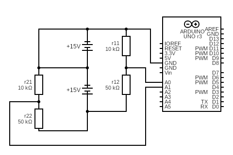

## Pinge mõõtmine
Praeguse konfiguratsiooniga mõõdab kuni 30v (mõlemad akud kokku)
Koosneb neljast takistist (kaks 10k oomist ja kaks 50k oomist). Paar moodustub 10k ja 50k resistorist, mille vahel jagatakse pinge (pinge_r1 --> r1/(r1+r2) ja pinge_r2 --> r2/(r1+r2)). Arduino mõõdab pinget väiksemas resistoris ja siis arvutab pinge akus. Nii arvutatakse pinge ühes akus ja mõlemas akus, lahutatakse kogupingest ühe aku oma ja saadakse mõlema aku pinged.

## Skeem

