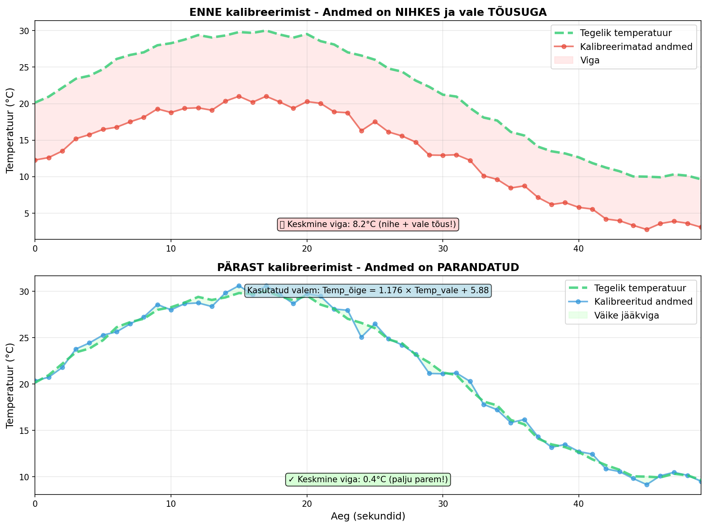
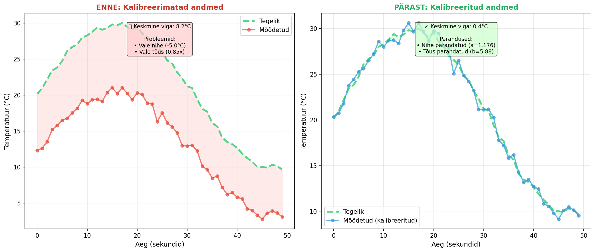
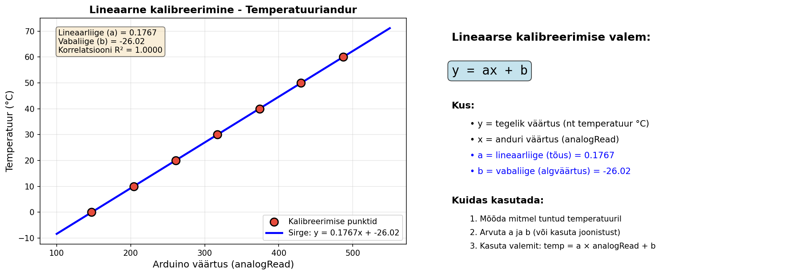
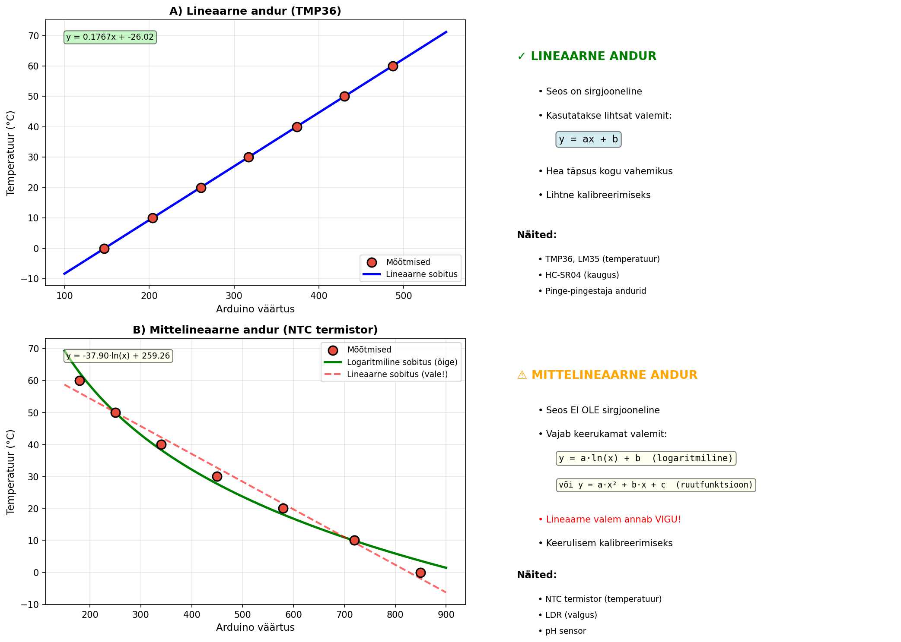

# Kalibreerimine - Lihtne õpetus

## Mis on kalibreerimine?

**Kalibreerimine** on protsess, kus me õpetame andurit või seadet mõõtma täpselt. See tähendab, et me võrdleme anduri näitu teadaoleva õige väärtusega ja parandame vahet.

## Miks me vajame kalibreerimist?

Andurid ei ole alati täpsed:
- Igal anduril on väikesed erinevused tootmisest
- Keskkond võib mõjutada mõõtmist (temperatuur, niiskus)
- Aja jooksul võivad andurid muutuda vähem täpseks

## Näide igapäevaelust

**Köögi kaal**: Kui sa paned tühja kausi kaalule, peaks see näitama 0g. Aga kui kaal näitab 15g, siis sa vajutad "TARE" nuppu. See kalibrееrib kaalu – nüüd ta teab, et praegune väärtus peaks olema 0g.

## Arduino näide

### Valgusandur (LDR)

Kui kasutad valgusandurit, võid saada väärtusi 0-1023. Aga:
- **Pimedas**: andur võib näidata 50 (mitte 0)
- **Eredas valguses**: andur võib näidata 900 (mitte 1023)

**Kalibreerimine aitab:**

```cpp
// Kalibreerimine - salvestame MIN ja MAX väärtused
int minValgus = 50;    // pimedaim väärtus
int maxValgus = 900;   // eredaim väärtus

void loop() {
  int toorväärtus = analogRead(A0);
  
  // Muudame väärtuse vahemikku 0-100%
  int protsent = map(toorväärtus, minValgus, maxValgus, 0, 100);
  protsent = constrain(protsent, 0, 100); // piiranguks 0-100
  
  Serial.print("Valgus: ");
  Serial.print(protsent);
  Serial.println("%");
  
  delay(500);
}
```

### Kalibreerimise efekt

Vaatame, mis juhtub, kui andur on kalibreerimatа - see näitab **vale nihke** (offset) ja **vale tõusu** (slope):



**Graafikul näed:**
- **Ülemine graafik (ENNE)**: 
  - Roheline kriipsjoon = tegelik temperatuur
  - Punane joon = kalibreerimatad andmed (alati liiga madal!)
  - Punane ala = viga (keskmine 8.2°C)
  - Probleem: Vale nihe (-5°C) JA vale tõus (0.85x)
- **Alumine graafik (PÄRAST)**: 
  - Sinine joon = kalibreeritud andmed (katab peaaegu tegeliku!)
  - Roheline ala = väike jääkviga (ainult 0.4°C)
  - Kasutatud valem: `Temp_õige = 1.176 × Temp_vale + 5.88`



**Külgmine võrdlus näitab:**
- **Vasak**: Kalibreerimatad andmed - selge nihega ja vale tõusuga (viga 8.2°C)
- **Parem**: Kalibreeritud andmed - väga täpsed (viga ainult 0.4°C, **20x parem!**)

**Miks nihe ja tõus on mõlemad olulised?**
- **Nihe** (b) parandab püsiva vea (nt andur näitab alati 5°C vähem)
- **Tõus** (a) parandab skaleerimise vea (nt viga kasvab kõrgematel temperatuuridel)
- Mõlemad koos annavad täpse tulemuse!

## Lineaarne kalibreerimine

### Mis on lineaarne kalibreerimine?

Paljud andurid annavad väljundväärtuse, mis on **lineaarses seoses** tegeliku väärtusega. See tähendab, et kui joonistada graafiku, saame **sirge joone**.

Lineaarne seos kirjeldatakse valemiga:

```
y = ax + b
```

Kus:
- **y** = tegelik väärtus (nt temperatuur °C)
- **x** = anduri väärtus (nt analogRead)
- **a** = **lineaarliige** (sirge tõus, slope) - näitab, kui palju y muutub, kui x muutub 1 ühiku võrra
- **b** = **vabaliige** (y-telje lõikepunkt, intercept) - näitab, mis on y väärtus, kui x = 0

### Kuidas leida a ja b?

**Meetod 1: Kahe punkti meetod**

1. Mõõda kahel teadaoleval väärtustel:
   - Punkt 1: Arduino näitab 200, tegelik temp = 10°C
   - Punkt 2: Arduino näitab 400, tegelik temp = 50°C

2. Arvuta lineaarliige (a):
   ```
   a = (y₂ - y₁) / (x₂ - x₁)
   a = (50 - 10) / (400 - 200) = 40 / 200 = 0.2
   ```

3. Arvuta vabaliige (b):
   ```
   b = y₁ - a × x₁
   b = 10 - 0.2 × 200 = 10 - 40 = -30
   ```

4. Lõplik valem:
   ```
   temperatuur = 0.2 × arduino_väärtus - 30
   ```

**Meetod 2: Mitme punkti meetod (täpsem)**

Mõõda mitmel erinevatel väärtustel ja kasuta graafikut või arvutiprogrammi (nt Excel, Python) sirge leidmiseks. See meetod on täpsem, sest see arvestab mõõtmisvigadega.



**Graafikul näed:**
- **Vasak pool**: Punased punktid on kalibreerimise mõõtmised, sinine sirge on leitud lineaarne seos
- **Parem pool**: Selgitus parameetrite kohta ja kuidas neid kasutada

### Arduino kood lineaarse kalibreerimisega

```cpp
// Temperatuurianduri lineaarne kalibreerimine
const float a = 0.1767;  // lineaarliige (tõus)
const float b = -26.02;  // vabaliige (algväärtus)

void loop() {
  int toorVaartus = analogRead(A0);
  
  // Rakenda lineaarset kalibreerimist
  float temperatuur = a * toorVaartus + b;
  
  Serial.print("Toor: ");
  Serial.print(toorVaartus);
  Serial.print(" → Temperatuur: ");
  Serial.print(temperatuur);
  Serial.println(" °C");
  
  delay(1000);
}
```

### Millal kasutada lineaarset kalibreerimist?

Lineaarne kalibreerimine sobib anduritele, mis annavad **sirgjoonelise** väljundi:
- ✅ TMP36, LM35 (temperatuuriandurid)
- ✅ HC-SR04 (ultraheli kaugusandur)
- ✅ Jõuandurid (load cells)
- ✅ Pinge jagaja andurid
- ✅ Potentsiomeetrid (nurga mõõtmine)
- ✅ Paljud industriaalsed andurid (4-20mA)

## Mittelineaarne kalibreerimine

### Mis on mittelineaarne kalibreerimine?

Mõned andurid ei anna lineaarset väljundit. See tähendab, et graafik **ei ole sirge**, vaid on kõver.

Näited mittelineaarsetest seostest:
- **Logaritmiline**: y = a·ln(x) + b
- **Eksponentsiaalne**: y = a·eˣ + b
- **Ruutfunktsioon**: y = a·x² + b·x + c
- **Steinhart-Hart** (NTC termistorid): keeruline valem temperatuuriks



**Graafikul näed:**
- **A) Lineaarne andur** (üleval vasakul) - mõõtmised asetsevad kenasti sirgel
- **B) Mittelineaarne andur** (all vasakul) - mõõtmised on kõveral
  - Roheline joon (õige) - logaritmiline sobitus
  - Punane kriipsjoon (vale!) - lineaarne sobitus annab VIGU
- **Paremal pool** - selgitused kumma puhul millist kalibreerimist kasutada

### Arduino kood mittelineaarse kalibreerimisega

**Näide: NTC termistor (lihtsustatud logaritmiline)**

```cpp
// NTC termistori lihtsustatud logaritmiline kalibreerimine
// TÄHELEPANU: Tegelik NTC vajab Steinhart-Hart valemit!

const float a = 85.5;   // logaritmiline koefitsient
const float b = -485.2; // vabaliige

void loop() {
  int toorVaartus = analogRead(A0);
  
  // Logaritmiline kalibreerimine
  float temperatuur = a * log(toorVaartus) + b;
  
  Serial.print("Toor: ");
  Serial.print(toorVaartus);
  Serial.print(" → Temperatuur: ");
  Serial.print(temperatuur);
  Serial.println(" °C");
  
  delay(1000);
}
```

**Märkus**: Päris NTC termistori jaoks kasuta valmis teeke nagu `Thermistor.h` või Steinhart-Hart valemit!

### Täpsem näide: NTC termistor (Steinhart-Hart)

NTC termistori täpseks mõõtmiseks kasutatakse **Steinhart-Hart võrrandit**:

```
1/T = A + B×ln(R) + C×ln(R)³
```

Kus:
- T = temperatuur Kelvinites
- R = takistus Ohmides  
- A, B, C = kalibreerimise konstandid (andurist sõltuvad)
- ln = naturaallogaritm

**Lihtsustatud Beta võrrand** (piisav enamikul juhtudel):

```cpp
// NTC termistori parameetrid
float R0 = 10000.0;  // takistus 25°C juures (10kΩ)
float Beta = 3950.0; // Beta koefitsient (andmelehelt)
float T0 = 298.15;   // 25°C Kelvinites

void loop() {
  int toor = analogRead(A0);
  
  // Arvuta takistus pinge jagajast
  float R = 10000.0 * (1023.0 / toor - 1.0);
  
  // Steinhart-Hart (Beta) võrrand
  float T = 1.0 / (1.0/T0 + (1.0/Beta) * log(R/R0));
  float tempC = T - 273.15; // Kelvin → Celsius
  
  Serial.print("Temperatuur: ");
  Serial.print(tempC);
  Serial.println(" °C");
  
  delay(1000);
}
```

### Millal kasutada mittelineaarset kalibreerimist?

Mittelineaarne kalibreerimine on vajalik anduritele, mille väljund **ei ole sirgjooneline**:
- ⚠️ NTC termistorid (negatiivne temperatuurikoefitsient)
- ⚠️ LDR (valgusandurid) - sageli mittelineaarne
- ⚠️ pH sensorid (Nernsti võrrand)
- ⚠️ Gaasisensorid (MQ seeria)
- ⚠️ Mõned niiskusandurid

**OLULINE**: Kui proovid lineaarset kalibreerimist kasutada mittelineaarse anduriga, saad **suuri vigu**! Graafikul B on näha, kuidas punane sirge ei vasta tegelikule kõverale seosele.

## Kalibreerimise sammud

1. **Mõõda miinimum** - pane andur kõige "väiksemasse" olukorda
2. **Mõõda maksimum** - pane andur kõige "suuremasse" olukorda  
3. **Salvesta need väärtused** - kasuta neid koodi sees
4. **Kasuta `map()` funktsiooni** - muuda toorväärtused kasulikuks vahemikuks

## Kokkuvõte

✓ Kalibreerimine teeb andurid täpsemaks  
✓ Salvestame tegelikud MIN ja MAX väärtused  
✓ Kasutame `map()` funktsiooni väärtuste teisendamiseks  
✓ Tulemus: usaldusväärsemad mõõtmised!

---

**Märkus õpetajale**: Seda õpetust saab laiendada praktilise harjutusega, kus õpilased kalibrееrivad oma andurit ja testavad tulemusi.
