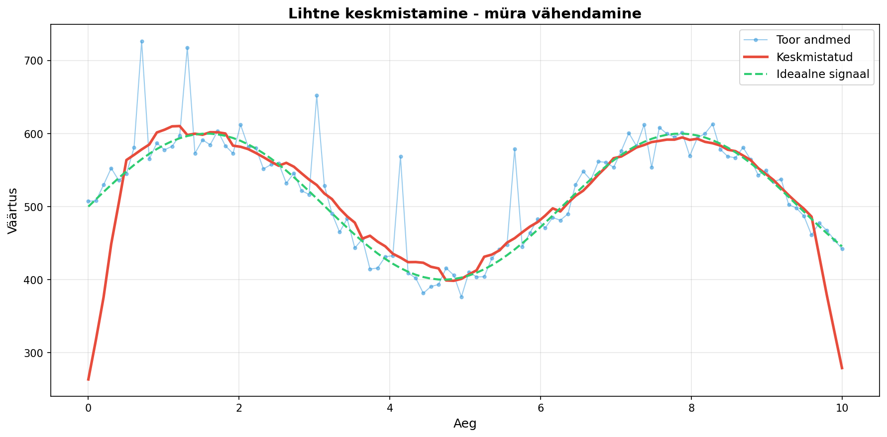
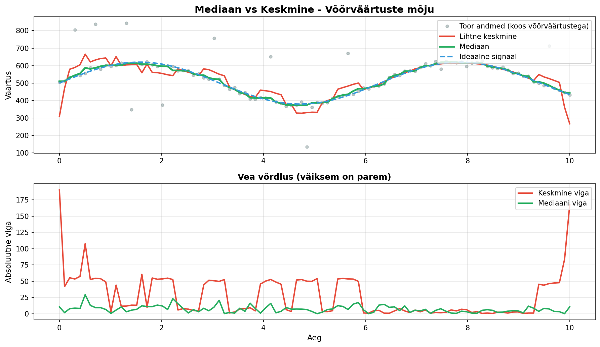
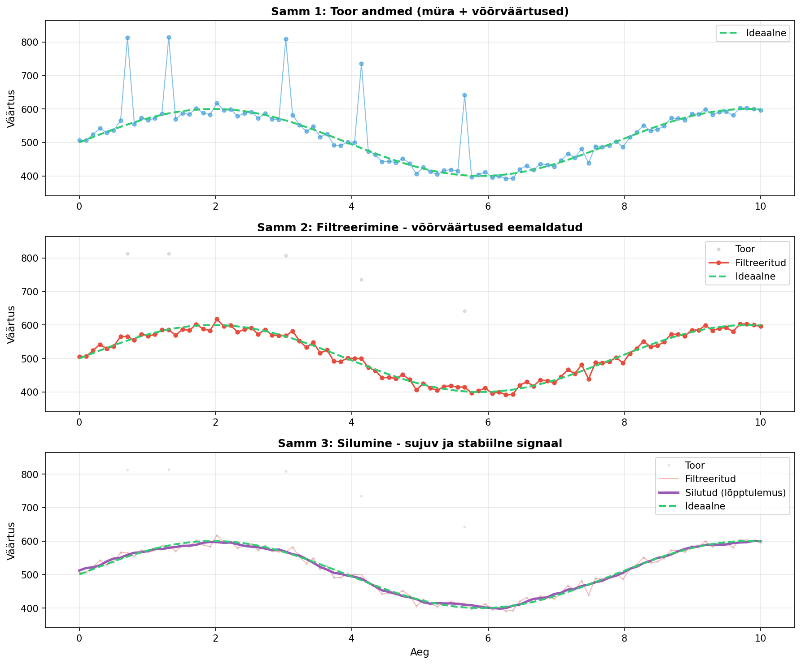
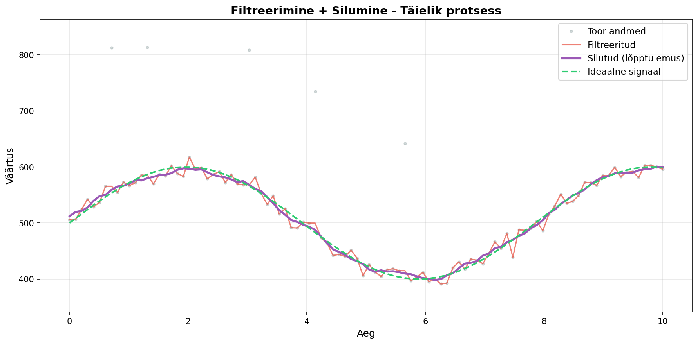

# Näitude silumine ja võõrväärtused

## Mis on probleem?

Kui loete anduritelt andmeid, võite märgata, et väärtused **hüppavad** või **kõiguvad**:
```
234, 235, 233, 489, 234, 236, 235, 234...
```

Üks väärtus (489) on hoopis vale! Sellist andmepunkti nimetatakse **võõrväärtuseks** (outlier).

## Miks see juhtub?

**Müra** (noise) võib tekkida paljudel põhjustel:
- Elektriline müra teistest seadmetest
- Anduri ebastabiilsus
- Lühiajalised häired (nt käega puudutamine)
- Halvad ühendused või kaablid
- Välised elektromagnetilised allikad

## Näide igapäevaelust

**Temperatuuri mõõtmine**: Kui mõõdad toa temperatuuri, siis tegelik temperatuur ei muutu sekundiga 20°C → 45°C → 21°C. Kui sellist andmete hüppamist näed, siis tegemist on võõrväärtustega, mitte tegeliku muutusega.

## 1. Lihtne keskmistamine (averaging)

Kõige lihtsam meetod: võta mitu mõõtmist ja arvuta keskmine.

```cpp
const int MÕÕTMISI = 10;

int loeMõõtmisi(int pin) {
  long summa = 0;
  
  for (int i = 0; i < MÕÕTMISI; i++) {
    summa += analogRead(pin);
    delay(10);  // väike paus mõõtmiste vahel
  }
  
  return summa / MÕÕTMISI;
}

void loop() {
  int väärtus = loeMõõtmisi(A0);
  Serial.println(väärtus);
  delay(500);
}
```



**Graafikul näed:**
- **Sinine joon** - toor andmed koos müraga
- **Punane joon** - keskmistatud andmed (palju sujuvam!)
- **Roheline kriipsjoon** - ideaalne signaal võrdluseks

**Plussid**: Lihtne, töötab hästi  
**Miinused**: Aeglane, ei reageeri kiiresti muutustele

## 2. Libisev keskmine (moving average)

Hoia meeles viimased N mõõtmist ja arvuta nende keskmine.

```cpp
const int MÄLU_SUURUS = 5;
int mõõtmised[MÄLU_SUURUS];
int indeks = 0;

void setup() {
  Serial.begin(9600);
  // Täida massiiv nullidega
  for (int i = 0; i < MÄLU_SUURUS; i++) {
    mõõtmised[i] = 0;
  }
}

void loop() {
  // Lisa uus mõõtmine
  mõõtmised[indeks] = analogRead(A0);
  
  // Arvuta keskmine
  long summa = 0;
  for (int i = 0; i < MÄLU_SUURUS; i++) {
    summa += mõõtmised[i];
  }
  int keskmine = summa / MÄLU_SUURUS;
  
  Serial.print("Toor: ");
  Serial.print(mõõtmised[indeks]);
  Serial.print(" | Silutud: ");
  Serial.println(keskmine);
  
  // Liigu järgmisele kohale (ring)
  indeks = (indeks + 1) % MÄLU_SUURUS;
  
  delay(100);
}
```

**Plussid**: Pidev uuendamine, paremini reageerib muutustele  
**Miinused**: Võõrväärtused mõjutavad endiselt tulemust

## 3. Mediaanfiltreerimine (median filter)

Võta N mõõtmist, sorteeri need ja vali keskmine väärtus. See **eemaldab võõrväärtused** väga hästi!

```cpp
const int MÕÕTMISI = 5;

int mediaanMõõtmine(int pin) {
  int mõõtmised[MÕÕTMISI];
  
  // Kogume mõõtmised
  for (int i = 0; i < MÕÕTMISI; i++) {
    mõõtmised[i] = analogRead(pin);
    delay(10);
  }
  
  // Lihtne sorteerimise algoritm (bubble sort)
  for (int i = 0; i < MÕÕTMISI - 1; i++) {
    for (int j = 0; j < MÕÕTMISI - i - 1; j++) {
      if (mõõtmised[j] > mõõtmised[j + 1]) {
        // Vaheta kohad
        int temp = mõõtmised[j];
        mõõtmised[j] = mõõtmised[j + 1];
        mõõtmised[j + 1] = temp;
      }
    }
  }
  
  // Tagasta keskmine väärtus
  return mõõtmised[MÕÕTMISI / 2];
}

void loop() {
  int väärtus = mediaanMõõtmine(A0);
  Serial.println(väärtus);
  delay(500);
}
```

**Näide**: Mõõtmised [234, 235, 489, 236, 233] → Sorteeritud [233, 234, 235, 236, 489] → Mediaan = 235



**Graafikul näed:**
- **Ülemine graafik**: 
  - Hall punktid - toor andmed koos võõrväärtustega
  - Punane joon - lihtne keskmine (võõrväärtused mõjutavad endiselt!)
  - Roheline joon - mediaan (võõrväärtused eemaldatud!)
  - Sinine kriipsjoon - ideaalne signaal
- **Alumine graafik**: Vea võrdlus - mediaan on täpsem!

**Plussid**: Väga hea võõrväärtuste eemaldamiseks  
**Miinused**: Vajab sorteerimist (arvutuslikult kallim)

## 4. Lihtne võõrväärtuste filtreerimine

### 4a. Absoluutväärtusega filtreerimine

Ignoreeri väärtusi, mis erinevad liiga palju eelmisest.

```cpp
int eelmine = 0;
const int MAX_MUUTUS = 50;  // maksimaalne lubatud muutus

void loop() {
  int uus = analogRead(A0);
  
  // Kontrolli, kas muutus on liiga suur
  if (abs(uus - eelmine) > MAX_MUUTUS) {
    Serial.print("VÕÕRVÄÄRTUS: ");
    Serial.print(uus);
    Serial.println(" - IGNOREERITUD");
    // Kasuta eelmist väärtust
  } else {
    Serial.println(uus);
    eelmine = uus;  // uuenda ainult siis, kui väärtus on OK
  }
  
  delay(100);
}
```

**Kasuta kui**: Tead täpset lubatud muutust (nt ±50 ühikut)  
**Näide**: Temperatuur ei muutu sekundiga rohkem kui 2°C

### 4b. Protsendipõhine filtreerimine

Ignoreeri väärtusi, mis erinevad liiga palju *protsendina* eelmisest. See on parem, kui töötad erinevate vahemikega.

```cpp
int eelmine = 512;  // alusta keskmise väärtusega
const float MAX_MUUTUS_PROTSENT = 15.0;  // maksimaalne muutus 15%

void loop() {
  int uus = analogRead(A0);
  
  // Arvuta muutus protsendina
  float muutus = abs(uus - eelmine) * 100.0 / eelmine;
  
  if (muutus > MAX_MUUTUS_PROTSENT) {
    Serial.print("VÕÕRVÄÄRTUS: ");
    Serial.print(uus);
    Serial.print(" (muutus: ");
    Serial.print(muutus);
    Serial.println("%) - IGNOREERITUD");
    // Kasuta eelmist väärtust
  } else {
    Serial.println(uus);
    eelmine = uus;
  }
  
  delay(100);
}
```

**Kasuta kui**: Väärtused muutuvad erinevates vahemikes  
**Näide**: Valgusandur, kus väärtus võib olla vahemikus 50-800. Pimedas on +10 ühikut suur hüpe, aga eredas valguses on +10 ühikut väike muutus.

**Plussid**: Kohandub automaatselt väärtuse tasemega  
**Miinused**: Ei tööta hästi, kui eelmine väärtus on väga väike (jagamine nulliga lähisel)

## 5. Filtreerimise ja silumise kombineerimine

Parim tulemus saavutatakse, kui kombineerida võõrväärtuste eemaldamist ja andmete silumist.

```cpp
// ========== FILTREERIMINE ==========
// Eemaldab võõrväärtused
int filtreeriVäärtus(int uusVäärtus, int eelmineVäärtus) {
  const int MAX_MUUTUS = 100;
  
  // Kui muutus on liiga suur, tagasta eelmine väärtus
  if (abs(uusVäärtus - eelmineVäärtus) > MAX_MUUTUS) {
    return eelmineVäärtus;  // võõrväärtus - ignoreeri
  }
  
  return uusVäärtus;  // väärtus OK
}

// ========== SILUMINE ==========
// Silub andmeid libiseva keskmisega
const int MÄLU_SUURUS = 5;
int mõõtmised[MÄLU_SUURUS];
int indeks = 0;
bool massiivTäidetud = false;

int siluVäärtus(int väärtus) {
  // Lisa väärtus massiivi
  mõõtmised[indeks] = väärtus;
  indeks = (indeks + 1) % MÄLU_SUURUS;
  
  if (indeks == 0) massiivTäidetud = true;
  
  // Arvuta keskmine
  long summa = 0;
  int loendur = massiivTäidetud ? MÄLU_SUURUS : indeks;
  
  for (int i = 0; i < loendur; i++) {
    summa += mõõtmised[i];
  }
  
  return summa / loendur;
}

// ========== PEAPROGRAMM ==========
int eelmineVäärtus = 512;  // alusta keskmise väärtusega

void setup() {
  Serial.begin(9600);
  // Täida massiiv algväärtusega
  for (int i = 0; i < MÄLU_SUURUS; i++) {
    mõõtmised[i] = eelmineVäärtus;
  }
}

void loop() {
  int toor = analogRead(A0);
  
  // Samm 1: Filtreeri võõrväärtused
  int filtreeritud = filtreeriVäärtus(toor, eelmineVäärtus);
  
  // Samm 2: Silu väärtus
  int silutud = siluVäärtus(filtreeritud);
  
  // Väljasta kõik väärtused võrdluseks
  Serial.print("Toor:");
  Serial.print(toor);
  Serial.print(",Filtreeritud:");
  Serial.print(filtreeritud);
  Serial.print(",Silutud:");
  Serial.println(silutud);
  
  eelmineVäärtus = filtreeritud;  // uuenda eelmist
  
  delay(100);
}
```

**Kuidas see töötab?**

1. **Filtreeri** - eemaldab äkilised võõrväärtused
2. **Silu** - teeb ülejäänud andmed sujuvamaks
3. **Tulemus** - stabiilne ja usaldusväärne signaal



**Graafikul näed kolm sammu:**
- **Samm 1**: Toor andmed - mürarikkas ja võõrväärtused
- **Samm 2**: Filtreeritud - võõrväärtused on eemaldatud
- **Samm 3**: Silutud - sujuv ja stabiilne lõpptulemus



**Võrdlusgraafik näitab:**
- **Hall punktid** - toor andmed
- **Punane joon** - filtreeritud (võõrväärtused kadunud)
- **Lilla joon** - silutud (sujuv ja täpne!)
- **Roheline kriipsjoon** - ideaalne signaal

## Millal millist meetodit kasutada?

| Meetod | Kasuta kui... | Näide |
|--------|--------------|-------|
| **Lihtne keskmistamine** | Väärtus on stabiilne, kiirus pole oluline | Toa temperatuur |
| **Libisev keskmine** | Vajad pidevat uuenemist | Valgusandur |
| **Mediaanfiltreerimine** | Palju võõrväärtusi | Ultraheli kaugusandur |
| **Võõrväärtuste kontrollimine** | Tead, kui suur muutus on normaalne | Temperatuur, niiskus |

## Praktiline nõuanne

Sageli on parim lahendus **kombineerida meetodeid**:
1. Esmalt eemalda võõrväärtused mediaanfiltreerimisega
2. Seejärel kasuta libisevat keskmist silumiseks

## Kokkuvõte

✓ Andurid annavad sageli "mürarikkaid" andmeid  
✓ Võõrväärtused on väärtused, mis on oluliselt erinevad  
✓ Keskmistamine silub andmeid  
✓ Mediaanfiltreerimine eemaldab võõrväärtused  
✓ Vali meetod sõltuvalt oma vajadusest  

---

**Õpetajale**: 
- Graafikud on loodud Python skriptidega illustreerimise eesmärgil
- Soovitatav on lasta õpilastel testida erinevaid meetodeid sama anduriga
- Arduino Serial Plotter aitab näha reaalajas tulemusi
- Kombineeritud meetod (filtreerimine + silumine) annab parimad tulemused praktikas
