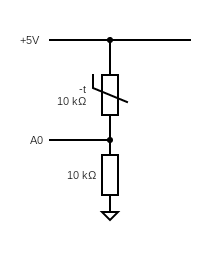
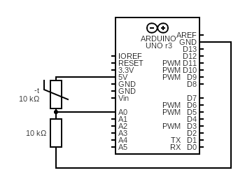
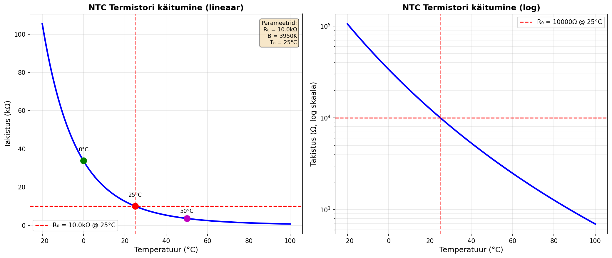

# Termistori kasutamine Arduinoga

## Sisukord
1. [Mis on termistor?](#1-mis-on-termistor)
2. [Termistori ühendamine](#2-termistori-ühendamine)
3. [Toor andmete lugemine](#3-toor-andmete-lugemine)
4. [Temperatuuri arvutamine](#4-temperatuuri-arvutamine)
5. [Kalibreerimine](#5-kalibreerimine)
6. [Silumine ja filtreerimine](#6-silumine-ja-filtreerimine)
7. [Lisa: Steinhart-Hart](#lisa-steinhart-hart-võrrand)

---

## 1. Mis on termistor?

### Definitsioon
**Termistor** = temperatuuritundlik takisti. Takistus muutub temperatuuriga.

### Tüübid
- **NTC** (Negative Temperature Coefficient) - takistus väheneb soojendades ← KASUTAME SEDA
- **PTC** (Positive Temperature Coefficient) - takistus suureneb soojendades

### Tingmärk


### Karakteristikud
- **R₀**: Takistus 25°C juures (nt 10kΩ, 22kΩ, 100kΩ)
- **B-väärtus**: Määrab temp tundlikkuse (nt 3950K)
- **Tolerants**: ±1%, ±5%, ±10%
- **Temp vahemik**: Tavaliselt -40°C kuni +125°C

### Termistor vs Termopaar

| Omadus | NTC Termistor | Termopaar |
|--------|--------------|-----------|
| Hind | Odav (~€1) | Kallis (~€20) |
| Temp vahemik | -40...+125°C | -200...+1800°C |
| Täpsus | ±0.5°C | ±2°C |
| Kiirus | Aeglane (sekundid) | Kiire (millisek) |
| Ühendus | Lihtne (2 juhet) | Raske (spets IC) |

**Kasuta termistorit kui:**
- Ruumi/vee temp (~0-100°C)
- Odav ja lihtne
- Täpsus oluline

**Kasuta termopaari kui:**
- Kõrged temperatuurid (>150°C)
- Kiirus kriitiline
- Lai vahemik

---

## 2. Termistori ühendamine

### Pinge jagaja skeem



### Mis on pinge jagaja?

**Pinge jagaja** on lihtne vooluahel, mis jagab sisendpinge kahe takisti vahel.

**Valem:**

$$V_{out} = V_{in} × \frac{R_{NTC}}{R_{fixed} + R_{NTC}}$$

**Kus:**
- $V_{in}$ = sisendpinge (Arduino puhul 5V)
- $V_{out}$ = väljundpinge (mõõdame A0 pinnil)
- $R_{fixed}$ = fikseeritud takisti (nt 10kΩ)
- $R_{NTC}$ = termistori takistus (muutub temperatuuriga!)

**Kuidas see töötab:**

1. Kui temperatuur **tõuseb** → $R_{NTC}$ **väheneb** (NTC!)
2. Kui $R_{NTC}$ väheneb → $V_{out}$ **väheneb**
3. Arduino mõõdab $V_{out}$ ja teisendab selle ADC väärtuseks

**Näide arvutus:**
- Ruumitemperatuuril (25°C): $R_{NTC}$ = 10kΩ
- $V_{out} = 5V × \frac{10kΩ}{10kΩ + 10kΩ} = 5V × 0.5 = 2.5V$
- ADC näitab: $2.5V × \frac{1023}{5V} ≈ 512$

**Takistuse arvutamine tagasi:**

Kui me teame $V_{out}$, saame arvutada $R_{NTC}$:

$$R_{NTC} = R_{fixed} × \frac{V_{out}}{V_{in} - V_{out}}$$

või lihtsustatud kujul:

$$R_{NTC} = R_{fixed} × (\frac{V_{in}}{V_{out}} - 1)$$

### Miks vajame fikseeritud takistit?
Arduino mõõdab PINGET, mitte takistust. Pinge jagaja teisendab takistuse muutuse pingeks.

❗**Soovitus**: Kasuta sama väärtusega takistit kui termistor @ 25°C
- 10kΩ termistor → 10kΩ takisti  
- 100kΩ termistor → 100kΩ takisti

### Ühendamine
**Komponendid:**
- Arduino
- NTC termistor (nt 10kΩ)
- Takisti 10kΩ
- Juhtmed

**Sammud:**
1. Ühenda 5V → termistor → A0
2. Ühenda A0 → takisti → GND
3. Valmis!

---

## 3. Toor andmete lugemine

### Mis on ADC?

**ADC** (Analog-to-Digital Converter) on **analoog-digitaalmuundur**. 

Arduino ei oska otse mõõta pinget - ta oskab ainult töötada numbritega (0 ja 1). ADC muundab **analoogse** pinge (nt 2.5V) **digitaalseks** numbriks (nt 512).

**Arduino Uno ADC:**
- **Lahutus**: 10-bitine → $2^{10} = 1024$ sammu
- **Vahemik**: 0V kuni 5V
- **Väärtused**: 0 kuni 1023
  - 0V → 0
  - 5V → 1023
  - 2.5V → 512
- **Täpsus**: Üks samm = $\frac{5V}{1024} ≈ 4.88mV$

**Näide:**
Kui termistor annab pinge 3.2V:
```
ADC väärtus = 3.2V × (1023 / 5V) ≈ 655
```

### Kood 1: ADC lugemine
```cpp
const int TERM_PIN = A0;

void setup() {
  Serial.begin(9600);
  Serial.println("ADC väärtus");
}

void loop() {
  int adc = analogRead(TERM_PIN);
  Serial.println(adc);
  delay(500);
}
```

**Mida näed:**
- Väärtused 0-1023
- Kui soojendad (sõrmega) → väärtus muutub
- Ruumitemp juures stabiilne

### Serial Plotter
1. Ava Tools → Serial Plotter
2. Näed graafikut reaalajas
3. Proovi: pihusta termistorit → jälgi kuidas muutub

### Kood 2: Pinge ja takistuse arvutamine
```cpp
const int TERM_PIN = A0;
const float R_FIXED = 10000.0;  // 10kΩ fikseeritud takisti
const float VCC = 5.0;          // VCC = toitepinge (Supply Voltage) Arduino'l 5V

void setup() {
  Serial.begin(9600);
  Serial.println("ADC\tPinge(V)\tTakistus(Ω)");
}

void loop() {
  int adc = analogRead(TERM_PIN);
  
  // Arvuta pinge (ADC → Volt)
  float V = adc * (VCC / 1023.0);
  
  // Arvuta termistori takistus (pinge jagaja valem)
  float R = R_FIXED * (VCC / V - 1.0);
  
  Serial.print(adc);
  Serial.print("\t");
  Serial.print(V, 2);
  Serial.print("\t\t");
  Serial.println(R, 0);
  
  delay(1000);
}
```

**Mis toimub koodis:**
1. Loeme ADC väärtuse (0-1023)
2. Teisendame ADC väärtuse pingeks: $V = ADC × \frac{5V}{1023}$
3. Arvutame termistori takistuse: $R_{NTC} = R_{fixed} × (\frac{5V}{V} - 1)$

---

## 4. Temperatuuri arvutamine

### B-väärtuse võrrand

**Valem:**

$\frac{1}{T}= \frac{1}{T₀} + \frac{1}{B} × ln(\frac{R}{R₀})$

$T_{celsius} = T_{kelvin} - 273.15$


**Kus:**
- $T$ = temperatuur Kelvinites (K)
- $T₀$ = 298.15K (25°C võrdlustemperatuur)
- $R₀$ = Termistori takistus 25°C juures (nt 10000Ω)
- $B$ = Beta väärtus (nt 3950K) - saad andmelehelt
- $R$ = Mõõdetud takistus (Ω)
- $\ln$ = naturaallogaritm

### Kuidas termistori takistus muutub?

Vaatame NTC termistori käitumist graafikul:



**Graafikul näed:**
- **Vasak pool**: Lineaarskaalal - selgelt mittelineaarne kõver!
- **Parem pool**: Logaritmiliseskaalal - sirge joon (seetõttu töötab logaritmiline valem)
- **Näited**: 
  - 0°C → 33.6kΩ
  - 25°C → 10kΩ
  - 50°C → 3.6kΩ
  - 100°C → 0.7kΩ

**Oluline:** Termistor on **mittelineaarne**! Takistus ei vähene ühtlaselt - see väheneb kiiremini kõrgematel temperatuuridel. Seetõttu ei saa kasutada lihtsat lineaarset valemit ja vajame B-väärtuse võrrandit.

### B-väärtuse leidmine

**Näide:** [Oomi pood](https://www.oomipood.ee/product/640_22k_22k_ntc_5_b3740k_500mw)

Toode: "22K NTC 5% B3740K"
- R₀ = 22kΩ @ 25°C
- B = 3740K
- Tolerants = 5%

**Tavaliselt andmelehel:**
- B-väärtus (nt B₂₅/₈₅ = 3950K)
- R vs T tabel
- Maksimaalne võimsus

### Täielik kood
```cpp
const int TERM_PIN = A0;
const float R_FIXED = 10000.0;   // Fikseeritud takisti
const float R0 = 10000.0;        // Termistor @ 25°C
const float T0 = 298.15;         // 25°C Kelvinites  
const float B = 3950.0;          // Beta (KONTROLLI ANDMELEHELT!)
const float VCC = 5.0;

void setup() {
  Serial.begin(9600);
  Serial.println("Temp(°C)");
}

void loop() {
  // Loe ADC
  int adc = analogRead(TERM_PIN);
  
  // Arvuta pinge
  float V = adc * (VCC / 1023.0);
  
  // Arvuta takistus
  float R = R_FIXED * (VCC / V - 1.0);
  
  // Arvuta temperatuur (B-väärtuse võrrand)
  float T_K = 1.0 / (1.0/T0 + (1.0/B) * log(R/R0));
  float T_C = T_K - 273.15;
  
  Serial.println(T_C, 1);
  delay(1000);
}
```

**Testimine:**
1. Ruumitemp: ~20-25°C
2. Sõrmede vahel: ~30-35°C
3. Külm õhk: langeb

---

## 5. Kalibreerimine

### Meetod 1: Nihe kalibreerimine
Kui on püsiv viga:

```cpp
const float KALIB_NIHE = -1.5;  // Parandus °C
T_C = T_C + KALIB_NIHE;
```

**Kuidas leida:**
1. Mõõda termomeetriga tegelik temp
2. Võrdle Arduino näit
3. Arvuta: $NIHE = T_{tegelik} - T_{Arduino}$

**Näide:**
- Tegelik temp (termomeetriga): 23.5°C
- Arduino näitab: 22.0°C
- $NIHE = 23.5 - 22.0 = 1.5°C$
- Koodis: `const float KALIB_NIHE = 1.5;`

### Meetod 2: Lineaarne kalibreerimine  
Kui viga muutub temperatuuriga:

```cpp
const float KALIB_A = 1.05;   // Tõus
const float KALIB_B = -2.0;   // Nihe
T_C = KALIB_A * T_C + KALIB_B;
```

**Valem:** $T_{õige} = a × T_{Arduino} + b$

**Kuidas leida a ja b:**
1. Mõõda 2 teadaoleval temp-l (nt 0°C ja 100°C)
2. Arvuta nagu lineaarse kalibreerimise tutorialis:
   - $a = \frac{T_{tegelik2} - T_{tegelik1}}{T_{Arduino2} - T_{Arduino1}}$
   - $b = T_{tegelik1} - a × T_{Arduino1}$

---

## 6. Silumine ja filtreerimine

### Kas ma vajan filtreerimist ja silumist?

**Kontrolli oma andmeid:**

1. **Käivita lihtne temperatuuri lugemise kood** (Samm 4 kood)
2. **Jälgi Serial Monitor'is või Serial Plotter'is**
3. **Hinda tulemusi:**

| Sümptom | Põhjus | Lahendus |
|---------|--------|----------|
| Väärtus hüppab palju (±2°C+) | Elektriline müra | ✅ Vajad silumist |
| Üksikud väga erinevad väärtused | Võõrväärtused | ✅ Vajad filtreerimist |
| Stabiilne ±0.1-0.5°C kõikumine | Normaalne ADC müra | ⚠️ Vajalik ainult täpse mõõtmise puhul |
| Täiesti stabiilne näit | Väga hea! | ❌ Pole vaja |

**Näited:**

```
Halb (vajab silumist):          Hea (pole vaja):
Temp: 24.2°C                    Temp: 24.5°C
Temp: 26.8°C  ← hüppab         Temp: 24.6°C
Temp: 23.1°C                    Temp: 24.4°C
Temp: 25.9°C                    Temp: 24.5°C
Temp: 22.4°C                    Temp: 24.6°C
```

**Üldine soovitus:**
- **Prototüüpimine ja testimine**: Pole vaja
- **Pikaajaline monitoorimine**: Lisa silumine (libisev keskmine)
- **Kriitilised rakendused** (nt 3D printer): Lisa filtreerimine + silumine
- **Juhtimissüsteemid** (termostat): Lisa silumine, et vältida liiga sagedat sisse/välja lülitumist

### Libisev keskmine
```cpp
const int N = 5;
float temps[N];
int idx = 0;

float silu(float uus) {
  temps[idx] = uus;
  idx = (idx + 1) % N;
  
  float summa = 0;
  for (int i = 0; i < N; i++) {
    summa += temps[i];
  }
  return summa / N;
}

void loop() {
  float toor = loeTemp();       // Funktsioon temp lugemiseks
  float silutud = silu(toor);
  
  Serial.print(toor, 1);
  Serial.print(",");
  Serial.println(silutud, 1);
  
  delay(500);
}
```

### Võõrväärtuste filter + silumine
```cpp
float eelmine = 25.0;
const float MAX_MUUTUS = 5.0;

float filtreeri(float uus) {
  if (abs(uus - eelmine) > MAX_MUUTUS) {
    return eelmine;  // Liiga suur hüpe - ignoreeri
  }
  eelmine = uus;
  return uus;
}

void loop() {
  float toor = loeTemp();
  float filtr = filtreeri(toor);
  float silutud = silu(filtr);
  
  Serial.println(silutud, 1);
  delay(500);
}
```

### Andmete analüüs hiljem
Kui soovid koguda **puhast** andmestikku:

```cpp
void loop() {
  float temp = loeTemp();
  Serial.print(millis());
  Serial.print(",");
  Serial.println(temp, 3);
  delay(100);  // Kiire samplimise kiirus
}
```

Siis analüüsi Pythonis/Excelis:
```python
import pandas as pd
df = pd.read_csv('andmed.csv')
df['silutud'] = df['temp'].rolling(10).mean()
```

---

## Lisa: Steinhart-Hart võrrand

### Täpsem meetod

**Valem:**

$$\frac{1}{T} = A + B × \ln(R) + C × \ln(R)^3$$

**Kus:**
- $T$ = temperatuur Kelvinites
- $R$ = termistori takistus (Ω)
- $A, B, C$ = Steinhart-Hart koefitsiendid (leida kalibreerimisega)
- $\ln$ = naturaallogaritm

**Millal kasutada:**
- Vajad ±0.1°C täpsust (vs ±1°C B-võrrandiga)
- Lai temp vahemik (-40...+125°C)
- Kriitiline rakendus

**Koefitsentide leidmine:**
Vajad 3 punkti (temp, takistus):
- T₁ = 0°C, R₁ = 32650Ω
- T₂ = 25°C, R₂ = 10000Ω  
- T₃ = 50°C, R₃ = 3602Ω

Kasuta kalkulaatorit: https://www.thinksrs.com/downloads/programs/therm%20calc/ntccalibrator/ntccalculator.html

### Kood
```cpp
const float A = 0.001129148;
const float B = 0.000234125;
const float C = 0.0000000876741;

void loop() {
  float R = loeV

õtimusus();  // Funktsioon takistuse lugemiseks
  
  float lnR = log(R);
  float T_K = 1.0 / (A + B*lnR + C*lnR*lnR*lnR);
  float T_C = T_K - 273.15;
  
  Serial.println(T_C, 2);
  delay(1000);
}
```

---

## Kokkuvõte

✅ Termistor on lihtne ja odav temp andur  
✅ Arduino ADC teisendab pinge numbriks (0-1023)  
✅ Pinge jagaja muudab takistuse muutuse pingeks  
✅ Ühenda pinge jagajaga (R_fixed + NTC)  
✅ Kasuta B-väärtuse võrrandit (piisav enamikuks)  
✅ Kalibreeri täpsuse jaoks  
✅ Kontrolli kas vajad silumist/filtreerimist  
✅ Steinhart-Hart kui vajad maksimaalset täpsust  

## Teised allikad:
- [Electronics tutorial](https://www.electronics-tutorials.ws/io/thermistors.html#/)
- [Circuit basics](https://www.circuitbasics.com/arduino-thermistor-temperature-sensor-tutorial/#/)
- [Steinhart–Hart equation wikipedia](https://en.wikipedia.org/wiki/Steinhart–Hart_equation#/)

